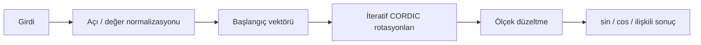

# CORDIC Hesap Makinesi

Trigonometrik, ters trigonometrik, hiperbolik ve logaritmik fonksiyonları CORDIC algoritmasıyla hesaplayan komut satırı uygulamasıdır. Proje, çarpma yoğun klasik yöntemlere alternatif olarak iteratif kaydırma ve toplama tabanlı sayısal hesaplama yaklaşımını gösterir.

## CORDIC nasıl çalışır?

CORDIC (COordinate Rotation DIgital Computer), bir vektörü önceden belirlenmiş küçük açılarla iteratif olarak döndürerek trigonometrik ve ilişkili fonksiyonları hesaplar. Uygun biçimde düzenlendiğinde her iterasyondaki `2^-i` katsayısı bit kaydırma ile temsil edilebildiği için yaklaşım özellikle donanım ve sabit noktalı aritmetik açısından önemlidir.



Temel dairesel rotasyon adımı kavramsal olarak şöyledir:

```text
x(i+1) = x(i) - d(i) * y(i) * 2^-i
y(i+1) = y(i) + d(i) * x(i) * 2^-i
z(i+1) = z(i) - d(i) * atan(2^-i)
```

Burada `d(i)` dönüş yönünü belirler. İterasyon sayısı arttıkça yaklaşık sonuç genellikle daha hassas hale gelir; bunun karşılığında hesaplama maliyeti yükselir.

## Özellikler

- `sin`, `cos`, `tan`, `cot`, `sec`, `csc`
- `arcsin`, `arccos`, `arctan`, `arccot`, `arcsec`, `arccsc`
- `sinh`, `cosh`, `tanh`, `coth`, `sech`, `csch`
- `arsinh`, `arcosh`, `artanh`
- `ln(x)` ve `logtaban(x, b)`
- Derece, radyan ve dönüşümsüz açı modları
- Önceki sonuçları tekrar kullanmak için ölçüm havuzu
- Varsayılan 40 CORDIC iterasyonu

## Güvenli ifade değerlendirme

Kullanıcı girdileri Python `eval` fonksiyonuna gönderilmez. İfadeler AST ile ayrıştırılır ve yalnızca izin verilen matematiksel yapıların çalışmasına izin verilir. Sayısal sabitler, temel aritmetik işlemleri, `pi`/`e` sabitleri ve desteklenen matematik fonksiyonları kabul edilir. Dosya erişimi, modül yükleme, özellik erişimi, koleksiyonlar, lambda ifadeleri ve anahtar kelimeli çağrılar reddedilir. Çok uzun, aşırı karmaşık veya kaynak tüketimine yol açabilecek büyük üs içeren ifadeler de sınırlandırılır.

## Çalıştırma

Harici bağımlılık gerekmez; Python 3.10 veya üzeri yeterlidir.

```bash
python CORDIC.py
```

Örnek oturum:

```text
mode deg
sin30 + cos60
2*tan45 + logtaban(8, 2)
list
```

Üs işlemi için hem kullanıcı dostu `^` yazımı hem de Python biçimindeki `**` desteklenir. `sin30` ifadesi otomatik olarak `sin(30)` biçimine çevrilir.

## Açı modları

| Komut | Trigonometrik giriş | Ters trigonometrik çıkış |
|---|---|---|
| `mode deg` | Derece | Derece |
| `mode rad` | Radyan | Radyan |
| `mode none` | Dönüşüm uygulanmaz | Radyan |

## Ölçüm havuzu

- `list`: kaydedilmiş sonuçları gösterir.
- `clear`: sonuçları temizler.
- `ölçüm[0]`: önceki sonucu yeni ifadede kullanır.
- `q`: uygulamadan çıkar.

## Tanım aralıkları

- `arcsin` ve `arccos`: `-1 ≤ x ≤ 1`
- `arcsec` ve `arccsc`: `|x| ≥ 1`
- `arcosh`: `x ≥ 1`
- `artanh`: `-1 < x < 1`
- `ln`: `x > 0`
- `logtaban`: `x > 0`, taban pozitif ve `1`den farklı

CLI içinde `help` veya `yardım` komutu daha ayrıntılı tanım aralıklarını gösterir.

## Testler

```bash
python -m unittest -v
```

Testler temel aritmetik ve fonksiyon sonuçlarının yanında kod çalıştırma, özellik erişimi, indeksleme, lambda ve aşırı büyük üs girişlerinin reddedildiğini de doğrular.

## Karmaşıklık ve sınırlılıklar

Tek bir CORDIC hesaplamasının iterasyon maliyeti seçilen hassasiyet `n` için yaklaşık `O(n)`'dir. `PREC` değeri yükseldikçe doğruluk genellikle artar, fakat hesaplama maliyeti de yükselir. Sıfıra çok yakın paydalara sahip `tan`, `sec`, `cot` ve `csc` işlemleri sayısal kararsızlığı önlemek amacıyla hata üretir.
